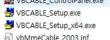

# mic-tts
자신의 입력장치에서 mp3, TTS가 출력되게 만들어줍니다.

**GUI by [@Lariel](https://github.com/La-riel)**

## 사용법
- virtual Cable 설치 [윈도우](https://download.vb-audio.com/Download_CABLE/VBCABLE_Driver_Pack43.zip)/[맥](https://download.vb-audio.com/Download_MAC/VBCable_MACDriver_Pack108.dmg)

- 
- 파일 실행 후 install driver 클릭
- 소리 설정에서 녹음창치가 MIDI 또는 Cable Input인지 확인
- 파이썬으로 할것이라면 파이썬 파일을 다운받은 폴더에 sounds 폴더를 생성한다. (sounds 폴더는 일단은 자동생성)
- [릴리즈](https://github.com/TeamUnle/mic-tts/releases)에 맨위 exe 다운로드하고 파일생성해 그 안에 넣고 실행
- 아래부터 첫번째는 재생 정지, 두번째는 TTS 입력창, 세번째는 음량 조절, 네번째는 sounds 폴더 내에 있는 mp3 음성 파일의 목록.

## 주의사항
- tts는 기본적으로 카카오tts(여자)를 사용하지만 tts를 받아오지 못하면 자동으로 구글tts(남자)로 바뀝니다.

## 기타
- 구글tts상태에서 `` `en (말)`` 으로 영어읽기가 된다(?)
- ## **코드 수정 환영**
- *저 늅늅이라 코드 더러움 ㅈㅅ*
